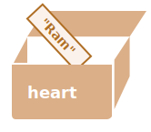

Most of the time, a Javascript/Node.js application needs to work with information. Here are two examples:

1. An online shop – the information might include goods being sold and a shopping cart.
2. A chat application – the information might include users, messages, and much more.

Variables are used to store this information.

## A variable 
A [variable](https://en.wikipedia.org/wiki/Variable_(computer_science)) is a “named storage” for data. We can use variables to store goodies, visitors, and other data.

To create a variable in Javascript/Node.js, use the `let` keyword.

The statement below creates (in other words: declares) a variable with the name “message”:

```js
let message
```

Now, we can put some data into it by using the assignment operator =:

```js
let message;

message = 'Shree'; // store the string 'Shree' in the variable named message
```
The string is now saved into the memory area associated with the variable. We can access it using the variable name:

```js
let message;
message = '!!Shree!!';
console.log(message); // shows the variable content
```

To be concise, we can combine the variable declaration and assignment into a single line:
```js
let message = '||Shree||'; // define the variable and assign the value

console.log(message); // ||Shree||
```

We can also declare multiple variables in one line:
```js
let user = 'Siya Ram', age = 25, message = 'Shree';

```
That might seem shorter, but we don’t recommend it. For the sake of better readability, please use a single line per variable.

The multiline variant is a bit longer, but easier to read:


```js
let user = 'Siya Ram';
let age = 25;
let message = 'Shree';
```

Some people also define multiple variables in this multiline style:

```js
let user = 'Siya Ram',
  age = 25,
  message = 'Shree';

```
…Or even in the “comma-first” style:

```js
let user = 'Siya Ram'
  , age = 25
  , message = 'Shree';

```
Technically, all these variants do the same thing. So, it’s a matter of personal taste and aesthetics.

:::info

In older scripts, you may also find another keyword: `var` instead of `let`:

```js
var heart = 'Ram';

```
The `var` keyword is almost the same as `let`. It also declares a variable, but in a slightly different, “old-school” way.

There are subtle differences between let and var, but they do not matter for us yet. We’ll cover them in detail in the chapter where we learn about functions and scope .
:::

## A real-life analogy

We can easily grasp the concept of a “variable” if we imagine it as a “box” for data, with a uniquely-named sticker on it.

For instance, the variable `heart` can be imagined as a box labeled `"heart"` with the value `"Ram"` in it:

